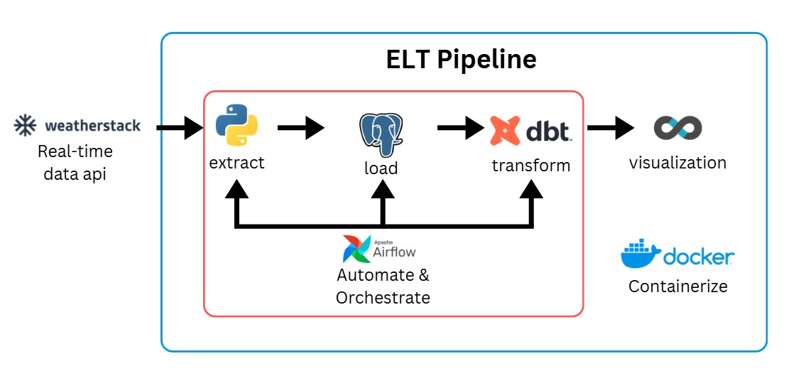

# End-to-End Weather Data Pipeline: Airflow, dbt, Postgres, Superset, Docker

## Overview

An end-to-end, fully containerized data pipeline that extracts live weather data from an external API, orchestrates its ingestion and transformation on a schedule, and visualizes it on a real-time dashboard - built with open-source tools running in Docker.

This project was built to apply core data engineering concepts outside of a managed cloud environment, in order to express the underlying mechanics. This project demonstrates end-to-end ownership of a data pipeline from - **raw ingestion through orchestration, transformation, and visualization** - using the same architectural patterns found in production systems, implemented here with open-source tools as the equivalent of their managed cloud counterparts:

| Managed AWS Equivalent | Open-Source Tool Used Here |
|---|---|
| Redshift | PostgreSQL |
| Glue | dbt |
| MWAA | Apache Airflow |
| QuickSight | Apache Superset |

---

## Architecture



```
Weatherstack API
      |
      v
Python Extraction Script  (requests library, error handling)
      |
      v
PostgreSQL  (raw landing zone: dev.raw_weather_data)
      |
      | <-- orchestrated on a schedule by Airflow -->
      v
dbt Transformation Layer
   staging  -> dedupe, clean, convert timezones
   marts    -> weather_report, daily_average
      |
      v
Superset Dashboard  (auto-refreshing chart)
```

**Orchestration flow:** a single Airflow DAG runs two dependent tasks every 5 minutes - first ingesting fresh data via a Python operator, then triggering a dbt run via a Docker operator once ingestion succeeds.

---

## Tech Stack & What Each Tool Does

| Tool | Role | Why It's There |
|---|---|---|
| **Python** | Extraction | Pulls live data from the Weatherstack API with proper error handling and retry-safe design |
| **PostgreSQL** | Storage | Serves as both the raw data landing zone and the destination for transformed models |
| **dbt** | Transformation | Converts raw, duplicated, UTC-timestamped records into clean, deduplicated, business-ready tables using SQL and version-controlled models |
| **Apache Airflow** | Orchestration | Schedules and sequences the extraction and transformation steps; tracks run history and failures |
| **Apache Superset** | Visualization | Connects directly to Postgres to build charts and an auto-refreshing dashboard |
| **Docker / Docker Compose** | Containerization | Every tool runs in an isolated container — nothing installed directly on the host machine, and the entire stack is reproducible with one command |

---

## Project Structure

```
weather-data-project/
├── airflow/
│   └── dags/
│       └── orchestrator.py          # DAG defining the ingest -> transform pipeline
├── api-request/
│   ├── api_request.py               # Extraction logic (fetch_data, mock_fetch_data)
│   └── insert_records.py            # DB connection, table creation, insert logic
├── dbt/
│   ├── profiles.yml                 # dbt connection profile
│   └── my_project/
│       └── my_project/
│           └── models/
│               ├── sources/         # Source declarations (raw_weather_data)
│               ├── staging/         # Cleaned, deduplicated staging model
│               └── mart/            # Business-ready tables (weather_report, daily_average)
├── docker/
│   ├── docker-init.sh
│   ├── docker-bootstrap.sh
│   └── superset_config.py           # Superset DB connection config
├── postgres/
│   ├── airflow_init.sql             # Creates dedicated Airflow metadata DB/user
│   └── superset_init.sql            # Creates dedicated Superset metadata DB/user
└── docker-compose.yaml              # Defines and networks all services together
```

---

## Data Model

### Raw Layer
`dev.raw_weather_data` — direct 1:1 landing zone for API responses (city, temperature, weather description, wind speed, timestamp, UTC offset).

### Staging Layer
`stg_weather_data` — deduplicates records using a `ROW_NUMBER()` window function partitioned by timestamp, and converts UTC timestamps to local time using the UTC offset.

### Mart Layer
- `weather_report` — trimmed, report-ready table of current conditions
- `daily_average` — daily average temperature and wind speed, grouped by city and date

This mirrors a standard raw → staging → mart layering pattern used in production dbt projects.

---

## Key Engineering Decisions

**Separate metadata databases per tool.** Airflow and Superset each get their own dedicated Postgres database and user (`airflow_db`, `superset_db`), isolated from the pipeline's actual business data in `db`. This keeps operational bookkeeping (DAG run history, dashboard configs) separate from analytical data — the same reason you wouldn't store application logs in the same schema as your sales fact table.

**Docker networking for service-to-service communication.** All containers share a custom bridge network so they resolve each other by service name (e.g., `db`, not an IP address) — while port mapping separately exposes services to the host machine for browser/CLI access.

**DockerOperator for cross-container orchestration.** Rather than running dbt inline within Airflow's own container, the DAG spins up a *separate* dbt container per run via Airflow's `DockerOperator`, mounting the Docker socket so Airflow can control sibling containers. This keeps dbt's dependencies fully isolated from Airflow's runtime.

**Idempotent extraction logic.** The ingestion script uses `try/except` blocks with explicit `raise_for_status()` checks and guarantees database connections close via a `finally` block — avoiding silent failures and connection leaks on a scheduled job.

---

## Dashboard


Real-time weather metrics for Los Angeles, visualized in Superset and auto-refreshing on a schedule aligned to the Airflow DAG's ingestion frequency. The dashboard tracks actual vs feels-like temperature, weather type distribution, temperature/wind speed correlation, and particulate matter concentration over time.

---

## Getting Started

### Prerequisites
- Docker Desktop with WSL2 integration enabled (Windows) or native Docker (Mac/Linux)
- A free [Weatherstack](https://weatherstack.com/) API key

### Setup

```bash
git clone https://github.com/Bassam-Atheeque/weather-datapipeline-airflow-DBT-docker-superset.git
cd weather-datapipeline-airflow-DBT-docker-superset
```

Add your Weatherstack API key to `api-request/api_request.py`.

### Run Everything

```bash
docker-compose up
```

This starts Postgres, Airflow, dbt, and Superset together on a shared network.

### Access the Services

| Service | URL | Notes |
|---|---|---|
| Airflow UI | http://localhost:8000 | Credentials printed in the terminal on first startup |
| Superset UI | http://localhost:8088 | Default login: admin/admin unless changed |

### Trigger the Pipeline

1. Open the Airflow UI and unpause the `weather-api-dbt-orchestrator` DAG
2. It will run automatically every 5 minutes, ingesting new data and running dbt transformations
3. Open Superset, connect to the `db` database (host: `db`, port: `5432`), and build a dataset off `stg_weather_data` or `daily_average`

---

## Known Limitations & Next Steps

- [ ] Move hardcoded credentials into environment variables with a `.env.example` template
- [ ] Add dbt tests (`not_null`, `unique`) on staging and mart models
- [ ] Add Airflow alerting (Slack/email) on task failure
- [ ] Replace local Docker orchestration with a managed equivalent (e.g., AWS MWAA + RDS) as a stretch goal
- [ ] Add CI (GitHub Actions) to lint dbt models and validate the DAG on every push
- [ ] Expand to multiple weather stations/cities to demonstrate partitioning strategies

---

## What This Project Demonstrates

- Understanding of orchestration vs. transformation vs. storage as distinct architectural layers
- Docker networking, volume mounting, and multi-service container coordination
- dbt modeling conventions (sources → staging → marts) and SQL-based deduplication
- Airflow DAG design, including cross-container task execution via `DockerOperator`
- Debugging real infrastructure issues: container permission mismatches, Docker networking scope, environment variable propagation

---

## Author

**Bassam Atheeque**
-- Business Intelligence Engineer II at Amazon
